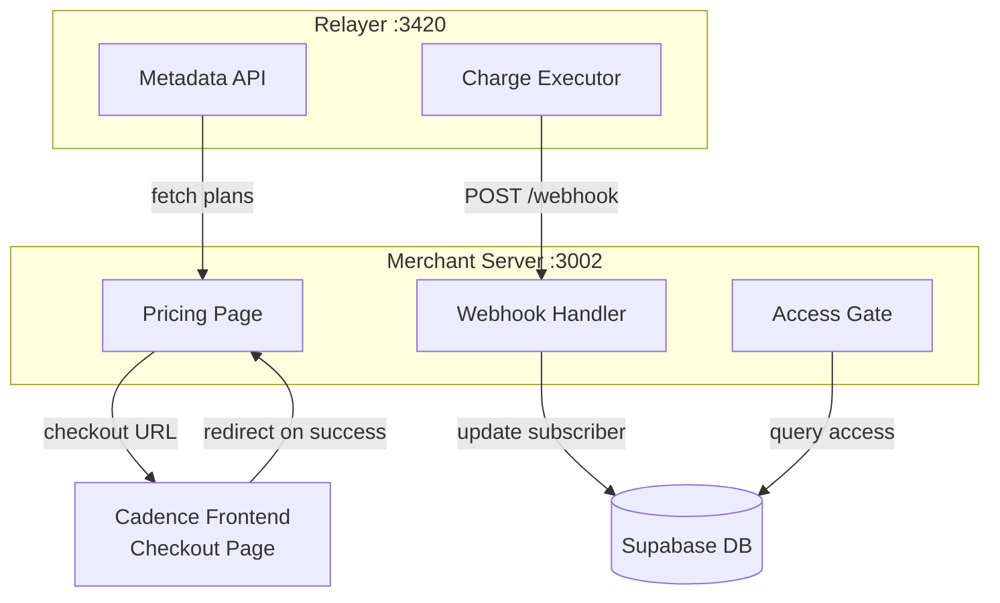
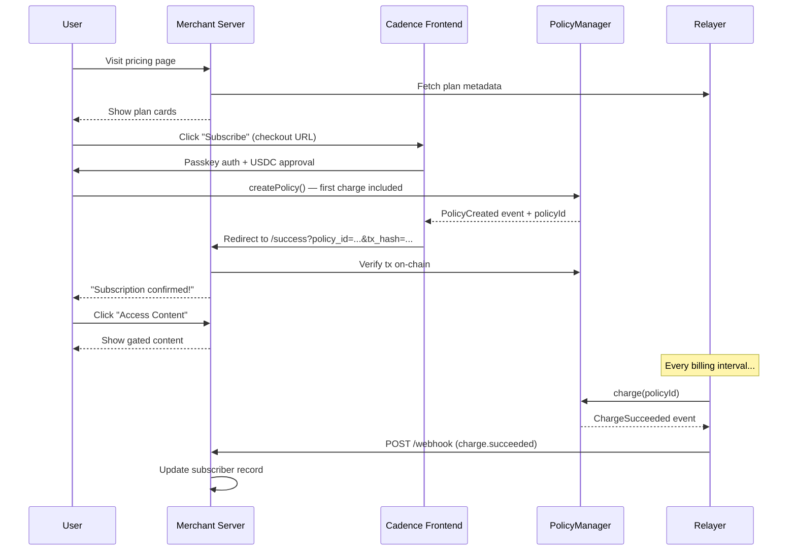
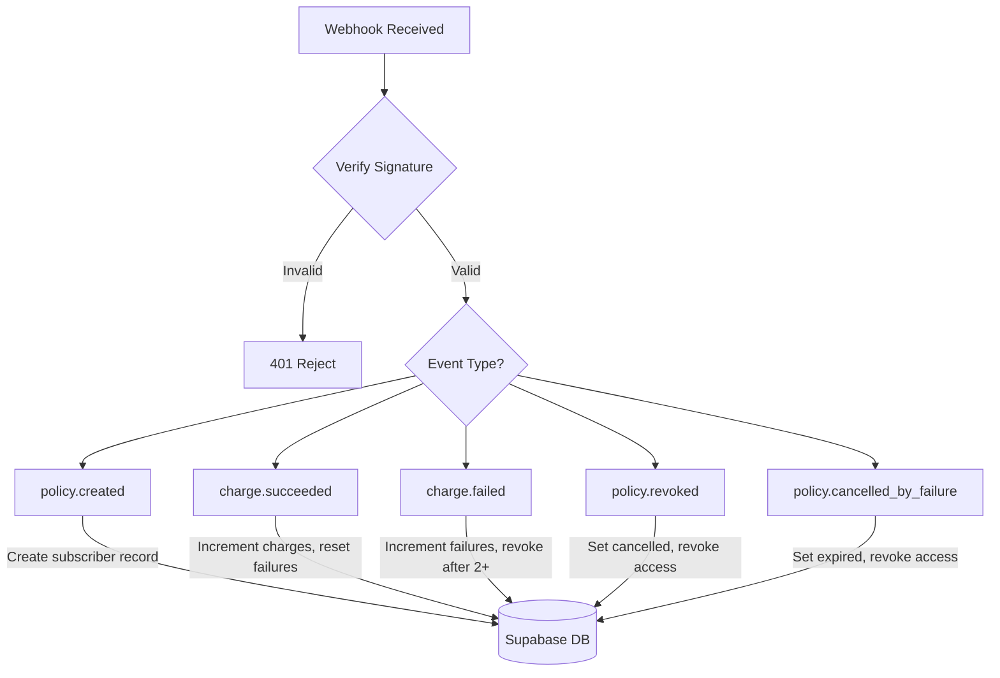
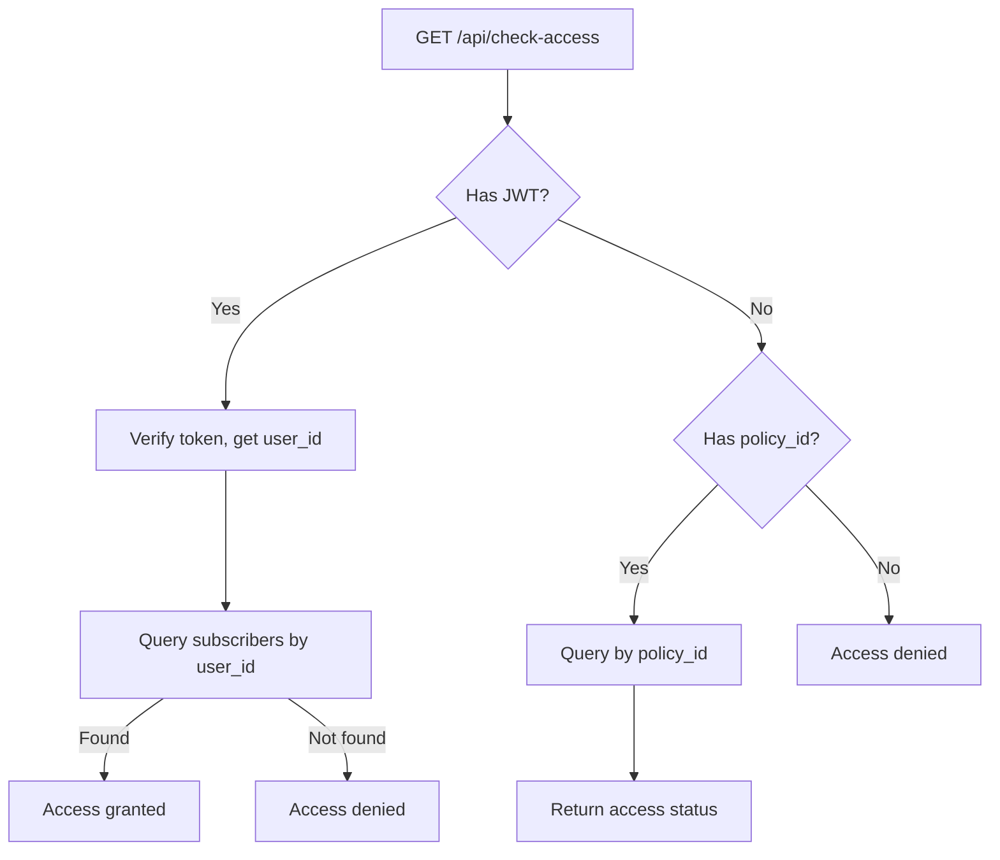

# Merchant Checkout Example

A complete working example of a merchant integrating Cadence for recurring subscription payments.

[View on GitHub](https://github.com/hola-official/Cadence-Protocol/tree/main/examples/merchant-checkout)

---

## Architecture

The example has three components that work together:



The **merchant server** is the only part you build. The Cadence frontend and relayer are shared infrastructure.

---

## Project Structure

```
examples/merchant-checkout/
└── merchant-server/
    ├── server.js              # Express server (all logic)
    ├── package.json
    ├── .env.example           # Environment template
    ├── metadata/
    │   ├── basic-plan.json    # Plan display info
    │   └── pro-plan.json
    └── public/
        ├── index.html         # Pricing page
        ├── login.html         # Auth (sign in / sign up)
        ├── success.html       # Post-checkout confirmation
        ├── cancel.html        # Checkout cancelled
        ├── content.html       # Gated premium content
        └── auth.js            # Shared Supabase auth helper
```

---

## End-to-End Flow



---

## Key Components

### 1. Pricing Page (`public/index.html`)

Fetches plans from the relayer's metadata API and renders cards with pricing, features, and a "Subscribe" button. The button links to the Cadence checkout with query params:

```
https://Cadenceprotocol.com/checkout?
  merchant=0x2B8b...
  metadata_url=http://localhost:3420/metadata/pro-plan
  amount=0.10
  interval=60
  spending_cap=1.20
  success_url=http://localhost:3002/success
  cancel_url=http://localhost:3002/cancel
```

### 2. Authentication (`public/login.html`, `public/auth.js`)

Uses Supabase Auth for email/password accounts. The auth helper (`auth.js`) provides shared functions used by all pages:

- `getSession()` — current Supabase session
- `getAccessToken()` — JWT for API calls
- `requireAuth()` — redirects to `/login` if not signed in
- `handleLogout()` — clears session

### 3. Webhook Handler (`server.js` — POST /webhook)

Receives events from the relayer and updates subscriber records in Supabase.



Signature verification uses `cadence-sdk`:

```javascript
import { verifyWebhook } from 'cadence-sdk'

const verified = verifyWebhook(payload, signature, WEBHOOK_SECRET)
// verified.type  → 'charge.succeeded'
// verified.data  → { policyId, payer, amount, ... }
```

### 4. Access Control (`server.js` — GET /api/check-access)

Gates premium content by checking the subscriber's status in the database.



### 5. Policy Claiming (`server.js` — POST /api/claim-policy)

After checkout, the success page calls this endpoint to link the on-chain policy to the authenticated user. This handles a race condition — the user may reach the success page before the webhook arrives.

- If webhook already created the record: associates `user_id`
- If webhook hasn't arrived yet: creates a placeholder that the webhook will later fill in

### 6. Gated Content (`public/content.html`)

Calls `/api/check-access` with the user's JWT. If access is granted, shows premium content. If not, shows a locked state with the reason (no subscription, cancelled, expired).

---

## Subscriber Lifecycle

The `merchant_subscribers` table tracks each subscription through its lifecycle:

| Status | access_granted | Trigger |
|--------|---------------|---------|
| `active` | `true` | `policy.created` or `charge.succeeded` |
| `past_due` | `true` (1st failure) / `false` (2nd+) | `charge.failed` |
| `cancelled` | `false` | `policy.revoked` (user cancelled) |
| `expired` | `false` | `policy.cancelled_by_failure` (3 consecutive failures) |

The grace period logic: first failed charge keeps access alive, second failure revokes it. The relayer auto-cancels the policy on-chain after 3 consecutive failures.

---

## Database Schema

The example uses a single `merchant_subscribers` table in Supabase:

| Column | Type | Description |
|--------|------|-------------|
| `policy_id` | text (PK) | On-chain policy identifier |
| `payer_address` | text | Subscriber's wallet address |
| `user_id` | uuid (FK) | Supabase auth user (linked via claim) |
| `plan_id` | text | Metadata URL identifying the plan |
| `status` | text | `active`, `past_due`, `cancelled`, `expired` |
| `access_granted` | boolean | Whether subscriber can access content |
| `charge_amount` | text | USDC amount per charge (raw, 6 decimals) |
| `interval_seconds` | integer | Billing interval in seconds |
| `total_charges` | integer | Number of successful charges |
| `total_paid` | text | Total USDC paid (BigInt string) |
| `last_charge_at` | timestamp | When last charge succeeded |
| `next_charge_expected_at` | timestamp | When next charge is due |
| `consecutive_failures` | integer | Failed charges in a row (resets on success) |
| `last_failure_reason` | text | `InsufficientBalance` or `InsufficientAllowance` |
| `subscribed_at` | timestamp | When subscription was created |
| `cancelled_at` | timestamp | When subscription was cancelled |

---

## Plan Metadata

Plans are JSON files served by the relayer. The example includes two demo plans with short intervals for testing:

```json
{
  "version": "1.0",
  "plan": {
    "name": "Pro Plan",
    "description": "Full access to all premium features",
    "tier": "pro",
    "features": ["Unlimited projects", "Priority support", "API access"]
  },
  "billing": {
    "amount": "0.10",
    "currency": "USDC",
    "interval": 60
  },
  "merchant": {
    "name": "DemoApp",
    "logo": "dumbell.png",
    "website": "https://demoapp.example.com",
    "supportEmail": "support@demoapp.example.com"
  },
  "display": {
    "color": "#6366F1",
    "badge": "Most Popular"
  }
}
```

---

## Running the Example

### Prerequisites

- Node.js >= 20
- Cadence frontend available at [Cadenceprotocol.com](https://Cadenceprotocol.com)
- Relayer running on port 3420 (`cd relayer && npm run dev`)
- Supabase project (for auth and subscriber tracking)

### Setup

```bash
cd examples/merchant-checkout/merchant-server

# Configure environment
cp .env.example .env
# Edit .env with your Supabase keys and merchant address

# Install and start
npm install
npm run dev
```

The server starts at `http://localhost:3002`. Visit it to see the pricing page.

### Testing the Flow

1. Visit `http://localhost:3002` — sign up with email/password
2. Pick a plan — redirects to Cadence checkout
3. Complete checkout with passkey — creates policy on-chain
4. Redirected to success page — policy verified and claimed
5. Click "Access Content" — gated content unlocked
6. Wait for the relayer to execute the next charge — `charge.succeeded` webhook arrives

---

## Configuration

| Variable | Default | Description |
|----------|---------|-------------|
| `PORT` | `3002` | Server port |
| `MERCHANT_ADDRESS` | — | Your wallet address for receiving payments |
| `CHECKOUT_URL` | `https://Cadenceprotocol.com/checkout` | Cadence frontend checkout URL |
| `RELAYER_URL` | `http://localhost:3420` | Relayer API for metadata |
| `WEBHOOK_SECRET` | `test-secret-123` | Shared secret for webhook verification |
| `SUPABASE_URL` | — | Supabase project URL |
| `SUPABASE_KEY` | — | Supabase service role key (server-side) |

---

## Related Documentation

- [Backend Integration Guide](./sdk-backend.md) — `cadence-sdk` reference
- [Merchant Guide](./merchant-guide.md) — Business-level overview
- [Relayer Operations](./relayer-operations.md) — Registering merchants and metadata
