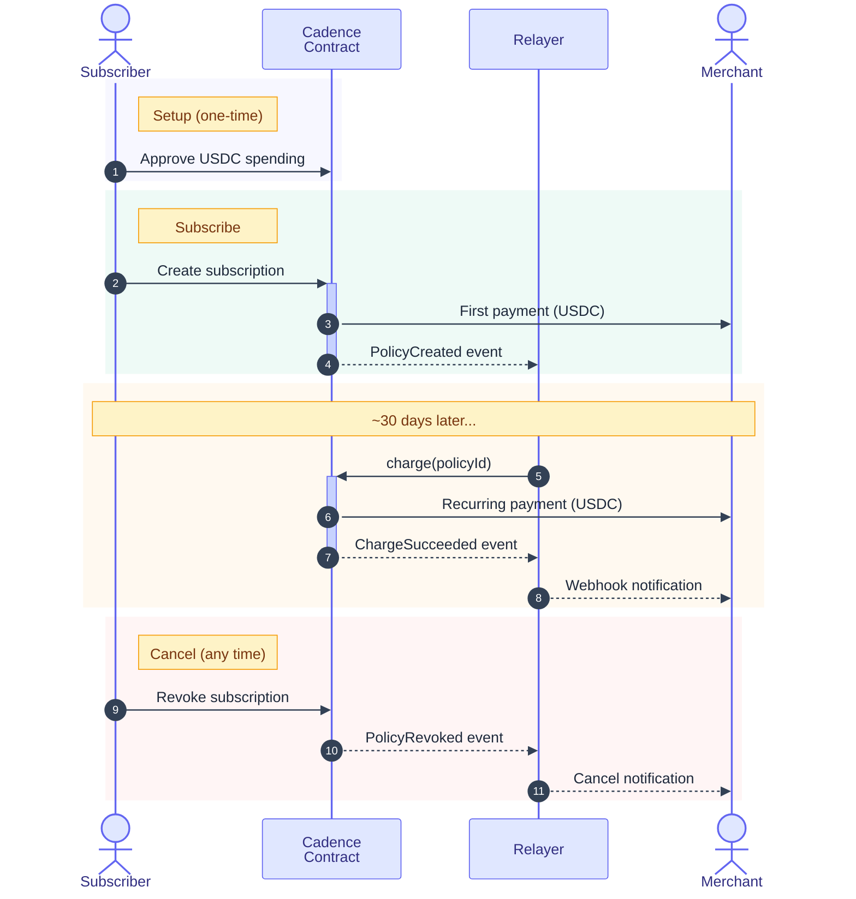

# Cadence Overview

## What is Cadence?

Cadence is a non-custodial crypto subscription payment protocol. It lets users pay for recurring services with USDC while keeping full control of their funds. Merchants receive payments automatically each billing cycle without building any payment infrastructure.

**One-liner:** Stripe for crypto subscriptions - 50% cheaper, non-custodial, multi-chain.

---

## Who Are These Docs For?

| If you are a... | Start here |
|-----------------|------------|
| **Subscriber** (paying for services) | [Subscriber Guide](./subscriber-guide.md) |
| **Merchant / business owner** (accepting payments) | [Merchant Guide](./merchant-guide.md) |
| **Backend developer** (handling webhook events) | [SDK Integration Guide](./sdk-backend.md) |
| **Relayer operator** (running the charge service) | [Running Locally](./relayer-local-setup.md) or [Deployment](./relayer-deployment.md) |

---

## How It Works

---

## Key Concepts

### Policies

A "policy" is a subscription agreement stored on-chain. It defines:

| Field | Description | Example |
|-------|-------------|---------|
| Merchant | Who receives payment | `0x742d...` |
| Charge amount | How much per cycle | 10 USDC |
| Interval | How often | 30 days |
| Spending cap | Maximum total spend | 120 USDC |
| Metadata URL | Plan details (name, features, branding) | `/metadata/pro-plan` |

Subscribers can revoke a policy at any time. Merchants cannot change the charge amount or interval - these are locked at creation.

### Non-Custodial

Funds stay in the subscriber's wallet until each charge is executed. Cadence never holds or pools user funds. The smart contract can only pull the exact charge amount at the agreed interval.

### Relayer

The relayer is a background service that:
- Monitors the blockchain for new subscriptions
- Executes charges when they're due
- Sends webhook notifications to merchants
- Handles retries and failure recovery

Merchants don't need to run any blockchain infrastructure - they just receive webhooks.

### Protocol Fee

Cadence charges a 2.5% fee on each payment. For a 10 USDC charge, the merchant receives 9.75 USDC and 0.25 USDC goes to the protocol. This is roughly half what traditional payment processors charge.

---

## Architecture

The system has three main components:

| Component | What it does | Who runs it |
|-----------|-------------|-------------|
| **Smart contract** (PolicyManager) | Stores subscription policies, executes charges, enforces limits | Deployed on-chain |
| **Relayer** | Indexes events, triggers charges, sends webhooks, serves metadata API | Operator / self-hosted |
| **Frontend** | Subscriber UI for managing subscriptions | Hosted by merchant or Cadence |

### Current Network

Cadence is live on **Arc Testnet** with USDC. Multi-chain support is powered by [Circle Gateway](https://developers.circle.com/gateway/references/supported-blockchains) — subscribers can pay from any supported chain and funds are automatically bridged to the merchant.

#### Supported Chains (via Circle Gateway)

| Mainnet | Testnet |
|---------|---------|
| Arbitrum | Arc Testnet |
| Avalanche | Avalanche Fuji |
| Base | Base Sepolia |
| Ethereum | Ethereum Sepolia |
| HyperEVM | HyperEVM Testnet |
| OP | Sei Atlantic |
| Polygon PoS | Solana Devnet |
| Sei | Sonic Testnet |
| Solana | World Chain Sepolia |
| Sonic | |
| Unichain | |
| World Chain | |

---

## Quick Links

### For Developers

- [SDK Integration Guide](./sdk-backend.md) - Webhook events and signature verification
- [Relayer Operations](./relayer-operations.md) - CLI commands, metadata, merchant management
- [Configuration Reference](./relayer-configuration.md) - All environment variables and settings
- [Deployment Guide](./relayer-deployment.md) - Railway, Docker, and direct deployment

### For Non-Developers

- [Subscriber Guide](./subscriber-guide.md) - How subscriptions work, cancelling, safety
- [Merchant Guide](./merchant-guide.md) - Accepting payments, pricing, getting started

---

## Safety & Trust

Cadence is designed with subscriber protection as a priority:

- **Spending caps** - Every subscription has a maximum total that can ever be charged
- **Fixed amounts** - Merchants cannot change the charge amount after creation
- **Instant cancellation** - Subscribers can cancel at any time, effective immediately
- **On-chain transparency** - All charges are visible on the blockchain
- **Non-custodial** - Funds stay in the subscriber's wallet until charged
- **Auto-cancel on failure** - After 3 consecutive failed charges, the subscription is automatically cancelled

---

## Pricing

| | Traditional (Stripe) | Cadence |
|---|---|---|
| Transaction fee | ~3-5% | 2.5% |
| Monthly fee | $0-25+ | None |
| Setup cost | None | None |
| Settlement time | 2-7 business days | Instant (on-chain) |
| Chargebacks | Yes | No |
| Currency | Fiat | USDC |
