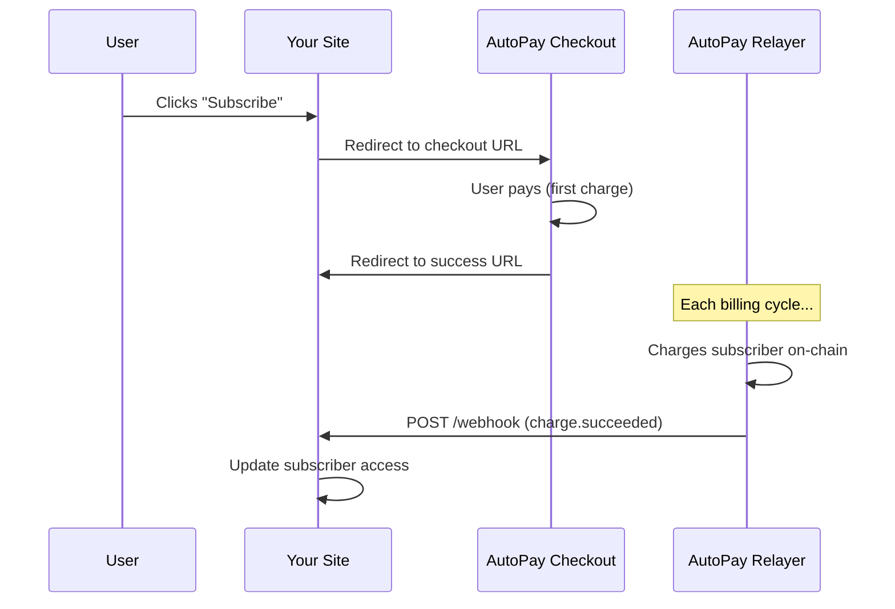

# Backend Integration Guide

## Overview

When subscribers sign up or get charged, AutoPay sends your server a signed webhook (HTTP POST) with event details. Your backend uses these to grant access, extend subscriptions, or handle cancellations.

The `@autopayprotocol/sdk` package provides typed webhook verification, checkout URL building, and USDC amount helpers. It's framework-agnostic and has zero runtime dependencies.

---

## How It Works



1. You build a **checkout URL** with your plan details and redirect users to it
2. The user subscribes and pays their first charge on the AutoPay checkout page
3. On success, the user is redirected back to your site
4. For each subsequent billing cycle, AutoPay's relayer charges the subscriber on-chain and sends your server a **webhook** with the result

You handle webhooks to manage access. Everything else is automatic.

---

## Prerequisites

- Node.js >= 20 (for SDK) or any HTTP server (for manual verification)
- A webhook secret (shared with the AutoPay relayer operator during merchant registration)

---

## Quick Start

### 1. Install the SDK

```bash
npm install @autopayprotocol/sdk
```

### 2. Build a checkout URL

```typescript
import { createCheckoutUrl } from '@autopayprotocol/sdk'

const url = createCheckoutUrl({
  merchant: '0xYOUR_MERCHANT_ADDRESS',
  amount: 9.99,
  interval: 'monthly',
  metadataUrl: 'https://yoursite.com/plans/pro.json',
  successUrl: 'https://yoursite.com/success',
  cancelUrl: 'https://yoursite.com/cancel',
  spendingCap: 119.88,
})

// Redirect users to this URL to start a subscription
```

### 3. Handle webhooks

```typescript
import { verifyWebhook } from '@autopayprotocol/sdk'

const WEBHOOK_SECRET = process.env.WEBHOOK_SECRET

// This example uses plain http, but works with any framework
import { createServer } from 'http'

createServer((req, res) => {
  if (req.method === 'POST' && req.url === '/webhooks/autopay') {
    let body = ''
    req.on('data', chunk => { body += chunk.toString() })
    req.on('end', () => {
      try {
        const event = verifyWebhook(body, req.headers['x-autopay-signature'], WEBHOOK_SECRET)
        console.log(`Received: ${event.type}`, event.data)

        // Always respond 200 to acknowledge receipt
        res.writeHead(200)
        res.end()
      } catch (err) {
        res.writeHead(401)
        res.end()
      }
    })
  }
}).listen(3500)
```

---

## Merchant Registration

Before you can receive webhooks, your merchant must be registered with the AutoPay relayer. Registration links your wallet address to a webhook URL and shared secret.

**If using a hosted relayer**, contact the relayer operator with:
- Your wallet address (where you receive USDC)
- Your webhook endpoint URL
- A webhook secret (any random string you choose)

**If self-hosting**, use the relayer CLI:

```bash
npm run cli -- merchant:add \
  --address 0xYOUR_MERCHANT_ADDRESS \
  --webhook-url https://yoursite.com/webhooks/autopay \
  --webhook-secret your_secret_here
```

---

## Checkout URLs

### Building a Checkout URL

`createCheckoutUrl()` validates your inputs and builds a URL that redirects users to the AutoPay checkout page:

```typescript
import { createCheckoutUrl } from '@autopayprotocol/sdk'

const url = createCheckoutUrl({
  merchant: '0x2B8b9182c1c3A9bEf4a60951D9B7F49420D12B9B',
  amount: 9.99,                    // USDC per billing cycle
  interval: 'monthly',             // or 'weekly', 'yearly', or seconds
  metadataUrl: 'https://yoursite.com/plans/pro.json',
  successUrl: 'https://yoursite.com/success',
  cancelUrl: 'https://yoursite.com/cancel',
  spendingCap: 119.88,             // optional - max total USDC
})
// → "https://autopayprotocol.com/checkout?merchant=0x...&amount=9.99&interval=2592000&..."
```

**Interval presets:** `'weekly'` (7 days), `'biweekly'` (14 days), `'monthly'` (30 days), `'quarterly'` (90 days), `'yearly'` (365 days). You can also pass raw seconds for custom intervals.

### Parsing the Success Redirect

After subscribing, the user is redirected to your `successUrl` with query params. Parse them to get the subscription details:

```typescript
import { parseSuccessRedirect } from '@autopayprotocol/sdk'

const { policyId, txHash } = parseSuccessRedirect(window.location.search)
```

---

## Webhooks

### Event Types

| Event | Description | When Sent |
|-------|-------------|-----------|
| `policy.created` | New subscription created | User subscribes to your plan |
| `charge.succeeded` | Recurring payment collected | Each billing cycle |
| `charge.failed` | Payment failed (will retry) | Insufficient balance or allowance |
| `policy.revoked` | Subscription cancelled by user | User cancels |
| `policy.cancelled_by_failure` | Auto-cancelled after 3 consecutive failures | Balance/allowance issues persist |

### Payload Format

Every webhook is an HTTP POST with a JSON body. The `event` field identifies the type, and `data` contains event-specific fields:

```json
{
  "event": "charge.succeeded",
  "timestamp": "2026-02-05T12:00:00.000Z",
  "data": {
    "policyId": "0x1234...abcd",
    "chainId": 5042002,
    "payer": "0xPAYER_ADDRESS",
    "merchant": "0xMERCHANT_ADDRESS",
    "amount": "10000000",
    "protocolFee": "250000",
    "txHash": "0xTX_HASH..."
  }
}
```

> **Note:** Amounts are in USDC's smallest unit (6 decimals). `"10000000"` = 10.00 USDC. Use `formatUSDC()` from the SDK to convert to human-readable values.

### Event-Specific Fields

All events include `policyId`, `chainId`, `payer`, and `merchant` in `data`. Additional fields per event:

| Event | Extra Fields |
|-------|-------------|
| `policy.created` | `chargeAmount`, `interval`, `spendingCap`, `metadataUrl` |
| `charge.succeeded` | `amount`, `protocolFee`, `txHash` |
| `charge.failed` | `reason` (`"InsufficientBalance"` or `"InsufficientAllowance"`) |
| `policy.revoked` | `endTime` |
| `policy.cancelled_by_failure` | `consecutiveFailures`, `endTime` |

### Signature Verification

Every webhook includes an HMAC-SHA256 signature in the `X-AutoPay-Signature` header. The signature is computed over the raw request body using your webhook secret.

| Header | Description |
|--------|-------------|
| `X-AutoPay-Signature` | HMAC-SHA256 hex digest of the request body |
| `X-AutoPay-Timestamp` | ISO 8601 timestamp of when the webhook was sent |
| `Content-Type` | `application/json` |

**Using the SDK:** `verifyWebhook()` verifies the signature and parses the payload in one call. It throws if the signature is invalid.

```typescript
import { verifyWebhook } from '@autopayprotocol/sdk'

try {
  const event = verifyWebhook(rawBody, req.headers['x-autopay-signature'], WEBHOOK_SECRET)
  // event.type is the event name, event.data is the typed payload
} catch (err) {
  // Invalid signature - reject
  res.writeHead(401)
  res.end()
  return
}
```

You can also verify without parsing:

```typescript
import { verifySignature } from '@autopayprotocol/sdk'

const isValid = verifySignature(rawBody, req.headers['x-autopay-signature'], WEBHOOK_SECRET)
```

**Manual verification** (without SDK):

```javascript
import { createHmac, timingSafeEqual } from 'crypto'

function verify(rawBody, signature, secret) {
  const expected = createHmac('sha256', secret).update(rawBody).digest('hex')
  if (signature.length !== expected.length) return false
  return timingSafeEqual(Buffer.from(signature), Buffer.from(expected))
}
```

### Handling Events

The SDK returns a discriminated union, so TypeScript narrows the `data` shape based on `event.type`:

```typescript
import { verifyWebhook, formatUSDC } from '@autopayprotocol/sdk'

const event = verifyWebhook(rawBody, signature, secret)

switch (event.type) {
  case 'policy.created':
    // New subscriber - first charge already collected
    grantAccess(event.data.payer, event.data.policyId)
    break

  case 'charge.succeeded':
    // Recurring payment collected - extend access
    console.log(`Collected ${formatUSDC(event.data.amount)} USDC`)
    extendAccess(event.data.payer, event.data.policyId)
    break

  case 'charge.failed':
    // Payment failed - consider notifying the user
    notifyPaymentFailed(event.data.payer, event.data.reason)
    break

  case 'policy.revoked':
    // User cancelled - revoke at end of billing period
    scheduleAccessRevocation(event.data.payer, event.data.policyId)
    break

  case 'policy.cancelled_by_failure':
    // Auto-cancelled after 3 consecutive failures - revoke immediately
    revokeAccess(event.data.payer, event.data.policyId)
    break
}
```

### Retry Policy

If your endpoint fails to respond with a 2xx status code, delivery is retried:

| Attempt | Timing |
|---------|--------|
| 1st | Immediate |
| 2nd | After ~1 minute |
| 3rd | After ~5 minutes |

Timeout is 10 seconds per attempt. Always respond `200` promptly, even if you process the event asynchronously.

---

## Amount Helpers

USDC amounts in webhooks are raw 6-decimal strings (e.g. `"10000000"` = 10.00 USDC). The SDK provides helpers for conversion and fee calculation:

```typescript
import { formatUSDC, parseUSDC, calculateFeeBreakdown } from '@autopayprotocol/sdk'

formatUSDC('9990000')           // "9.99"
parseUSDC(9.99)                 // "9990000"

const fees = calculateFeeBreakdown('10000000')
// { total: "10.00", merchantReceives: "9.75", protocolFee: "0.25", feePercentage: "2.5%" }
```

---

## Complete Example

A minimal webhook receiver:

```javascript
import { createServer } from 'http'
import { verifyWebhook } from '@autopayprotocol/sdk'

const PORT = 3500
const WEBHOOK_SECRET = process.env.WEBHOOK_SECRET

const server = createServer((req, res) => {
  if (req.method === 'GET' && req.url === '/health') {
    res.writeHead(200, { 'Content-Type': 'application/json' })
    res.end(JSON.stringify({ status: 'ok' }))
    return
  }

  if (req.method === 'POST' && req.url === '/webhook') {
    let body = ''
    req.on('data', chunk => { body += chunk.toString() })
    req.on('end', () => {
      try {
        const event = verifyWebhook(body, req.headers['x-autopay-signature'], WEBHOOK_SECRET)
        console.log(`Received: ${event.type}`, event.data)
        res.writeHead(200, { 'Content-Type': 'application/json' })
        res.end(JSON.stringify({ received: true }))
      } catch (err) {
        res.writeHead(401, { 'Content-Type': 'application/json' })
        res.end(JSON.stringify({ error: 'Invalid signature' }))
      }
    })
    return
  }

  res.writeHead(404)
  res.end()
})

server.listen(PORT, () => {
  console.log(`Webhook receiver listening on port ${PORT}`)
})
```

For a full merchant server with checkout URLs, auth, access gating, and database tracking, see the [Checkout Example](./merchant-checkout-example.md).

---

## SDK Reference

For the full API reference, see the [SDK README](https://github.com/apeoverflow/Auto-Pay-Protocol/tree/main/packages/sdk).

| Category | Functions |
|----------|-----------|
| **Checkout** | `createCheckoutUrl()`, `parseSuccessRedirect()`, `resolveInterval()` |
| **Webhooks** | `verifyWebhook()`, `verifySignature()`, `signPayload()` |
| **Amounts** | `formatUSDC()`, `parseUSDC()`, `calculateFeeBreakdown()`, `formatInterval()` |
| **Metadata** | `validateMetadata()`, `createMetadata()` |
| **Constants** | `intervals`, `PROTOCOL_FEE_BPS`, `chains` |

---

## Troubleshooting

### Not Receiving Webhooks

- Confirm your merchant is registered with the relayer operator
- Ensure your webhook URL is publicly reachable (use [ngrok](https://ngrok.com) for local testing)
- Check that you're responding with a 2xx status code within 10 seconds

### Invalid Signature Errors

- Ensure `WEBHOOK_SECRET` matches what was registered during merchant setup
- Verify you're computing the HMAC over the **raw request body string**, not a parsed/re-serialized JSON object

### Webhook Payloads Missing Fields

Some fields are event-specific. For example, `amount` and `protocolFee` only appear on `charge.succeeded` events. Use the SDK's discriminated union types to safely access fields per event type.

---

## Related Documentation

- [Checkout Example](./merchant-checkout-example.md) - Full merchant server with auth, webhooks, and access gating
- [Merchant Guide](./merchant-guide.md) - Business-level overview for non-technical stakeholders
